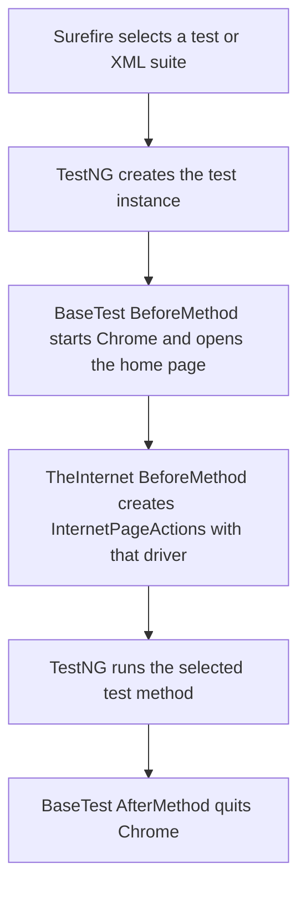

# UI Automation

Java and Selenium WebDriver tests for [The Internet](https://the-internet.herokuapp.com/). Maven builds the project, TestNG defines and groups tests, and ChromeDriver drives a real Chrome browser.

## Requirements

- JDK 25 or newer. The Maven compiler source and target are configured as Java 25.
- Apache Maven available as `mvn` on `PATH`.
- Google Chrome installed. Selenium Manager, included with Selenium, resolves the matching ChromeDriver.
- Network access to `the-internet.herokuapp.com`.

Check the local tools from PowerShell:

```powershell
java -version
mvn -version
```

## Project Layout

| Path | Purpose |
| --- | --- |
| `src/main/java/base/BaseTest.java` | Creates a browser for each test, opens the application, waits for the home page, and quits the browser after the test. |
| `src/main/java/pages/InternetPageActions.java` | Selenium locators and interactions for the demo site's pages. Receives its `WebDriver` through its constructor. |
| `src/test/java/tests/TheInternet.java` | TestNG test methods and their smoke/regression group annotations. |
| `src/test/resources/smoke-testng.xml` | Suite selecting the `smoke` group. |
| `src/test/resources/regression-testng.xml` | Suite selecting the `regression` group. |
| `src/test/resources/File.txt` | Local fixture used by the file-upload test. |
| `pom.xml` | Java compiler, Selenium, TestNG, and Maven Surefire configuration. |

The standalone `src/test/resources/testng.xml` currently points to `base.BaseTest`, not the test class. Use the smoke and regression suites below, or select `TheInternet` directly, to run tests.

## Design and Selenium Concepts

- **Page Object Model-style separation:** test methods are kept in `TheInternet`; Selenium locators and page interactions are grouped in `InternetPageActions`. The actions class accepts a `WebDriver` instead of creating its own browser.
- **Test fixture / base class:** `BaseTest` owns browser setup and cleanup shared by test methods.
- **Constructor dependency injection:** `TheInternet` passes its current browser to `InternetPageActions`, so setup and page actions operate on the same session.
- **WebDriver APIs:** the tests use `By` locators, `WebElement`, `Select` for dropdowns, `Actions` for hover/drag/right-click, and browser alert handling.
- **Waits and assertions:** setup waits for the home page; page actions use Selenium waits where needed; TestNG assertions verify expected behavior.
- **TestNG groups:** methods are tagged `smoke`, `regression`, or both, and the XML suites select the corresponding group.

This is a small action-object design rather than a separate page class for every URL. Locators currently use XPath and a few ID selectors.

## TestNG Workflow



Each test gets a fresh browser session. `alwaysRun = true` ensures setup and cleanup are applied to group-selected tests too.

### Groups and Coverage

The smoke suite includes `addRemoveElements`, `verifyCheckboxes`, and `login`. The regression group includes all 13 test methods, including those same three smoke tests. Therefore, running both XML suites runs 16 test invocations: the three shared methods run once in each suite.

The test methods cover the A/B test page, add/remove elements, checkboxes, context menu, drag and drop, dropdowns, dynamic controls, entry ad, file download/upload, login, hover, and numeric input.

## Run Tests

Run commands from the repository root, the directory containing `pom.xml`. PowerShell treats unquoted comma-separated `-D` values as separate arguments, so quote the entire property argument as shown.

### Both suites

```powershell
mvn test "-Dsurefire.suiteXmlFiles=src/test/resources/smoke-testng.xml,src/test/resources/regression-testng.xml"
```

### One suite

```powershell
mvn test "-Dsurefire.suiteXmlFiles=src/test/resources/smoke-testng.xml"
mvn test "-Dsurefire.suiteXmlFiles=src/test/resources/regression-testng.xml"
```

### Select tests without an XML suite

```powershell
# Run every method in the TheInternet test class
mvn test "-Dtest=TheInternet"

# Run one method
mvn test "-Dtest=TheInternet#addRemoveElements"

# Run the smoke group
mvn test "-Dtest=TheInternet" "-Dgroups=smoke"

# Run the regression group
mvn test "-Dtest=TheInternet" "-Dgroups=regression"
```

### Build and clean

```powershell
# Compile and run tests
mvn test

# Delete build output, then compile and run tests
mvn clean test

# Package the project after tests
mvn package
```

`TheInternet` does not match Maven Surefire's usual automatic test-class naming patterns, so use an XML suite or the explicit `-Dtest=TheInternet` selector rather than relying on plain `mvn test` to discover it.

The same Maven commands work in Command Prompt and other shells; keeping the property quoted is also valid there.

## Reports and Troubleshooting

- Surefire and TestNG reports are written under `target/surefire-reports/` after a run. Useful files include `testng-results.xml` and `emailable-report.html`.
- An `Unknown lifecycle phase` error containing a suffix like `.xml,regression=...` usually means the `-D` argument was split or the suite filename was mistyped. Quote the full property and use `regression-testng.xml`.
- `NoSuchElementException` means the expected element was not found on the current page. Check that the browser reached the expected route and that the locator still matches the live demo site.
- Selenium may warn that its CDP module does not match the installed Chrome version. This is a compatibility warning; check the test result summary to determine whether the build actually failed.

## Main Dependencies

| Dependency | Version | Use |
| --- | --- | --- |
| Selenium Java | 4.21.0 | Browser automation |
| TestNG | 7.10.2 | Test annotations, groups, suites, and assertions |
| WebDriverManager | 5.8.0 | Declared driver-management dependency; current tests instantiate `ChromeDriver` directly and use Selenium Manager. |
| Maven Surefire | 3.2.5 | Runs TestNG tests from Maven |